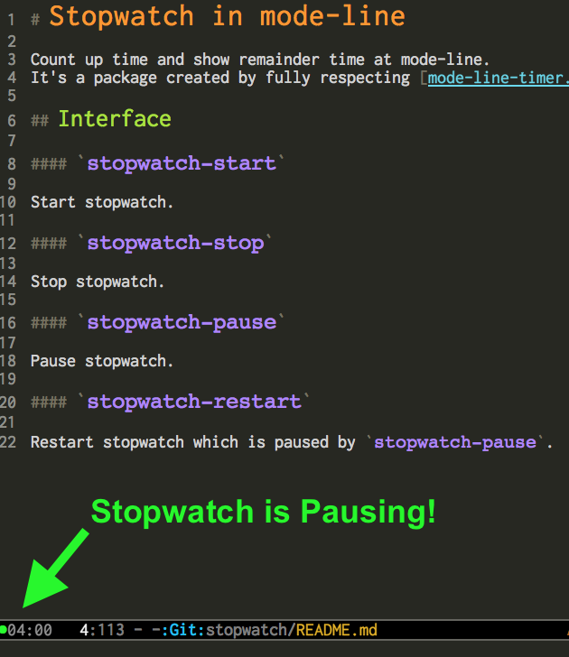

# Stopwatch in mode-line

Count up time and show remainder time at mode-line.

It's a package created by fully respecting [mode-line-timer.el](https://github.com/syohex/emacs-mode-line-timer).

## Screenshot

## Interface

#### `stopwatch-start`

Start stopwatch.

#### `stopwatch-stop`

Stop stopwatch.

#### `stopwatch-pause`

Toggle (pause/resume) stopwatch.

#### `stopwatch-restart`

Restart stopwatch counter to begin from 0.

## Desktop Notification

It's only available for MacOS because it uses AppleScript.

#### `stopwatch-notification-time`

Set timer for the desktop notification.

